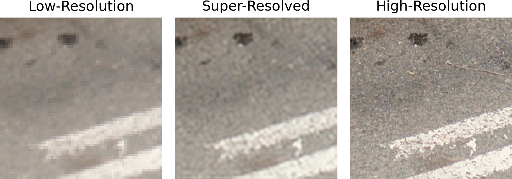
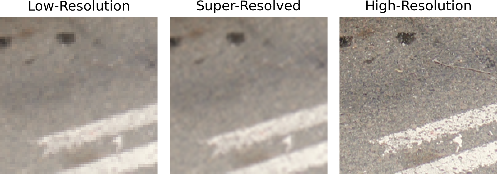
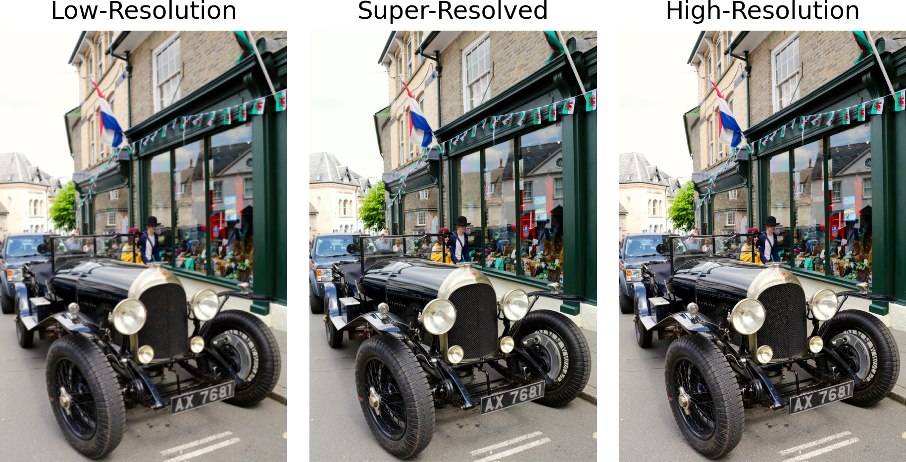
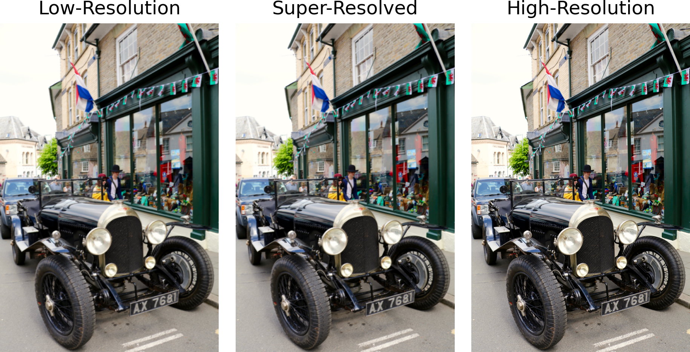

# AMLS2 Image super-resolution 

This project focus on the image super-resolution based on div2k dataset (https://github.com/tensorflow/datasets/blob/master/docs/catalog/div2k.md). A VDSR (very deep super resolution) model is trained on the div2k datasets track1: div2k/bicubic_x2 and div2k/bicubic_x3, and track2: div2k/unknown_x2 and div2k/unknown_x3. 

Pleas note that the model is designed for training and working saparately on each data subset with different down scale methods and factors. You can select one dataset to do training or inference by adjusting the global variables in 'train.py' and 'main.py'. 

'train.py' is for training only and it saves the trained parameter into files 'track1' or 'track2'. 'main.py' can be used for both train and inference. Because the training process takes a long time, the training in 'main.py' is defaultly disabled so that it uses the saved parameters in 'track1' or 'track2' to do inference. 


## Run Locally

For inference only, run 'python main.py' in the terminal can do the inference.

```bash
  python main.py
```

You can enter 'main.py' to select dataset or change any corresponding parameters. The PnP-ADMM network can be enabled for improve the results for track1. 

(🔸Due to the time limit, The PnP-ADMM network is only designed for track1 [bicubic down scaled] images)

(🔸Do not enable the PnP-ADMM network for track2 dataset)

You can also decide if crop the images by use different data processing method according to the documentation and instructions in this file. 

Once run 'python main.py', the remind of succuss of resolving each image will be printed in the terminal since it may take a long time for one image when the size of image is large or when the interation times of PnP-ADMM network is high. The psnr and ssim values of the model output images and their averages will also be demonstrated as criterias to do envaluation. The images up-scaled by bicubic function is also created for comparison. Once low-resolution image will be selected to do the comparison. Two images are saved to the 'outputs' file for each execution: One compares the lr, sr form model, and original hr, and the other one compares lr, sr up-scaled by bicubic function, and original hr. This helps user to observe percetual loss.   

Some typical inference results are included in the 'outputs' file, you can you there to check the model performance and compare with simple bicubic up-sampling.


## Result demonstration
Demonstration of typical super-resolved results.

### Screenshots







